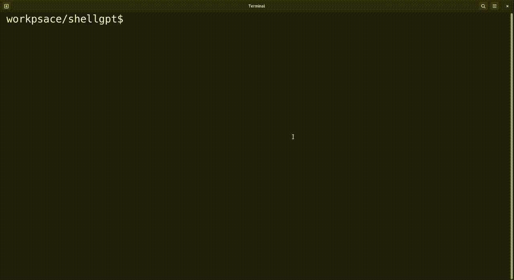

# ShellGPT
A tool that leverage ChatGPT, to convert a human language sentence into a linux shell command.
With this, no more need to remember the linux command :)

## install
```
git clone https://github.com/elbombardi/shellgpt.git
cd shellgpt
go install
```

## API Key 
* Go to https://platform.openai.com, and create an account (or sign in your account).
* Generate a new API key, 
* Store the API Key as the environement variable OPENAI_API_KEY.

## Usage
`shellgpt` 

## Demo
